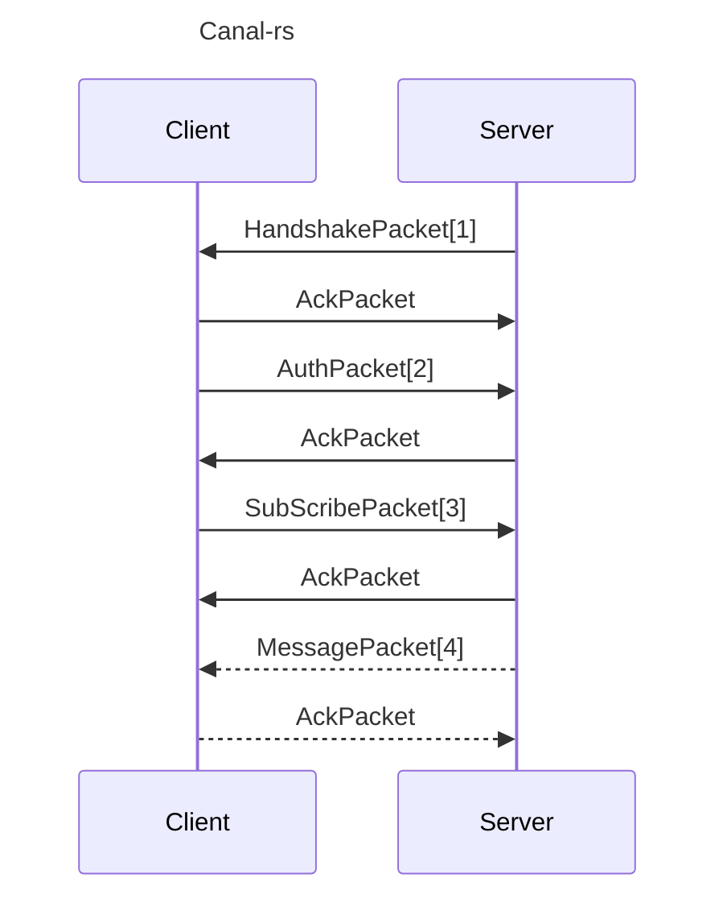

# canal-rs

```mermaid
sequenceDiagram
	participant Client
	Title: Canal-rs
	Server ->> Client: HandshakePacket[1]
	Client ->> Server: AckPacket
	Client ->> Server: AuthPacket[2]
	Server ->> Client: AckPacket
	Client ->> Server: SubScribePacket[3]
	Server ->> Client: AckPacket
	Server -->> Client: MessagePacket[4]
	Client -->> Server: AckPacket
```

